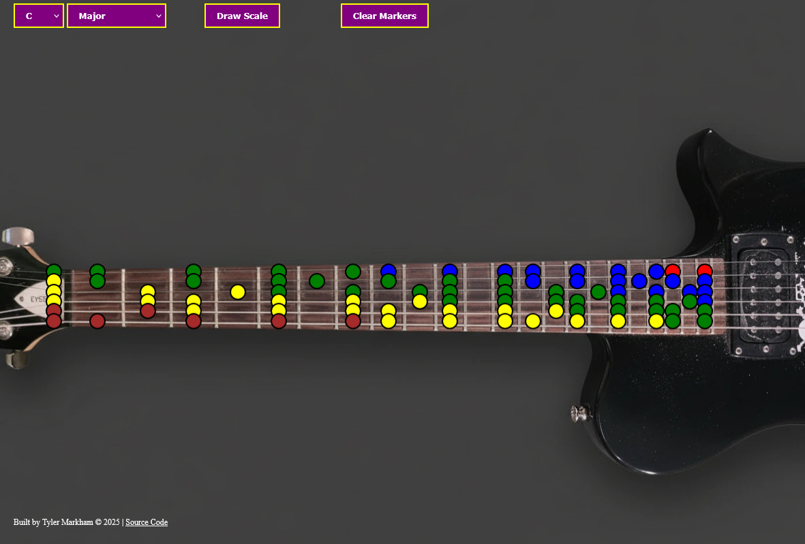

# Scale Wizard

A guitar fretboard tool to visualize scales and identify scales from selected notes.

## Features
- View scales across the fretboard
- Select root note and scale type
- Color-coded note display

## Live Demo
[Try it here](https://rrozz.github.io/Scale-Wizard)

## How to Use
1. Select a root note (ex: C)
2. Select a scale type (ex: Major)
3. Click the Draw Scale button to show notes in the scale

## Roadmap
- Add more scales
- Pan/zoom functionality
- Reverse scale finder
- Improve note alignment
- Isolate contiguous steps within a scale and allow user to play an emulated piano/guitar with the isolated chord notes

## Known Issues
 - The markers on the string are misaligned with the fretboard image

Built as a learning project and personal tool for guitar practice.

© 2025 Tyler Markham
